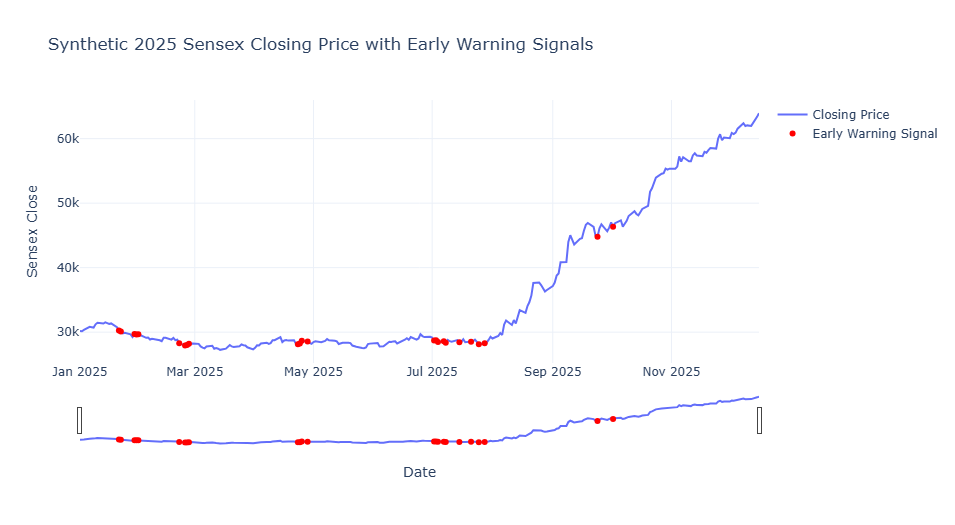

# 📉 Market Crash Analysis & Early Warning System (EWS)

A data-driven analysis of market crashes using historical Sensex data and synthetic future trends, with an early warning system (EWS) based on volatility and return dynamics.

---

## 🧾 Project Overview

This project focuses on analyzing market crashes and developing an Early Warning System (EWS) that identifies potential signs of downturns based on historical data patterns. By studying how markets behave before, during, and after crashes, this analysis aims to better understand risk dynamics and detect signals that could help anticipate future declines.

---

## 💼 Business Problem

Financial markets are inherently volatile, and sudden crashes can result in severe losses for investors, institutions, and businesses. Detecting warning signals before such events can help mitigate risks and improve decision-making.

**Objective:**
- Identify periods of extreme market stress.  
- Group these periods into clusters to understand crash characteristics.  
- Analyze market behavior during and after crashes.  
- Develop an early warning system based on return and volatility patterns.

---

## 📊 Dataset Description

The analysis uses historical market data (such as Sensex closing prices) and a synthetic dataset for 2025 to simulate potential market conditions.

**Key variables include:**
- **Date:** Trading day  
- **Close:** Daily closing price of the market index  
- **Daily_Return:** Percentage change in price compared to the previous day  
- **Rolling_Mean_Return:** 10-day average return, representing short-term momentum  
- **Rolling_Volatility:** 10-day rolling standard deviation of returns, measuring market instability  
- **Warning:** Boolean flag showing when the early warning criteria are triggered  

---

## ⚙️ Methodology

**1. Market Crash Identification**  
Crashes are detected using daily percentage changes and drawdown methods.  
Drawdown helps measure the decline from recent peaks, highlighting stress periods.

**2. Crash Clustering**  
Consecutive drawdown days are grouped into clusters to represent distinct crash phases.  
Each cluster is analyzed to reveal duration, intensity, and recovery behavior.

**3. Visualization & Comparative Analysis**  
Multiple charts are used to visualize price movement, returns, and drawdown during crash periods.  
These visualizations highlight unique market behaviors across different crashes.

**4. Early Warning System (EWS)**  
Rolling mean returns and volatility are calculated over a 10-day window.  
Warning conditions are triggered when returns turn negative and volatility exceeds a defined threshold.  
The signals are plotted on the closing price chart to visualize potential risk periods.

---

## 🖼️ Visualization Preview

Below is one of the key visualizations showing the relationship between closing prices, daily returns, and drawdown levels during crash periods.

---

## 🔍 Insights

- Market crashes are typically preceded by increased volatility and sustained negative returns.  
- The rolling-based EWS effectively identifies periods of instability, even in synthetic data.  
- Visualizing return and volatility interactions provides a clear picture of how stress builds before major declines.

---

## 🧮 Summary & Conclusion

Through this analysis, the following were achieved:

- Identified market crashes using daily percentage changes and drawdown methods.  
- Grouped consecutive stress days into distinct crash clusters.  
- Visualized and compared crash periods to uncover market behavior patterns.  
- Developed an early warning system using rolling returns and volatility metrics.  

This project demonstrates how combining statistical indicators and visualization can help identify potential early warning signs of market downturns. While the thresholds and conditions are heuristic, they can be fine-tuned using real data to improve prediction accuracy. The methodology can serve as a foundation for more advanced predictive systems using machine learning or real-time market monitoring.

---

## 📁 Project Files

- `Market_Crash_Analysis.ipynb` — Jupyter notebook with full analysis and visualizations  
- `sensex.csv` — Dataset used for analysis  
- `newplot.png` — Visualization showing price movement, returns, and drawdown  
- `README.md` — Project documentation

---

